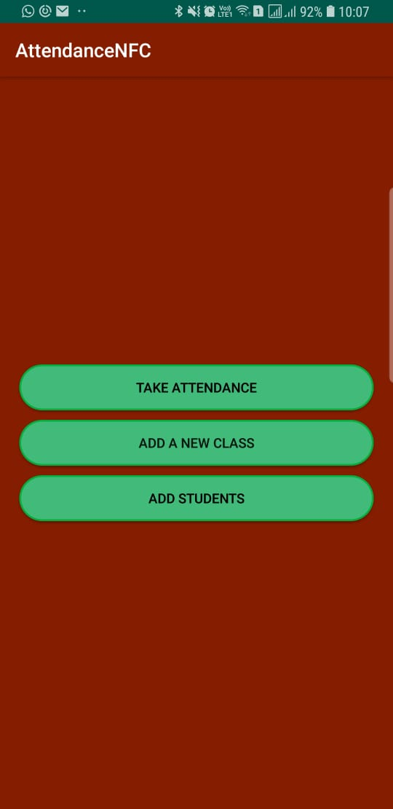
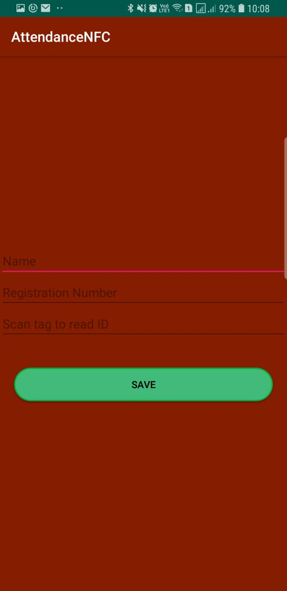
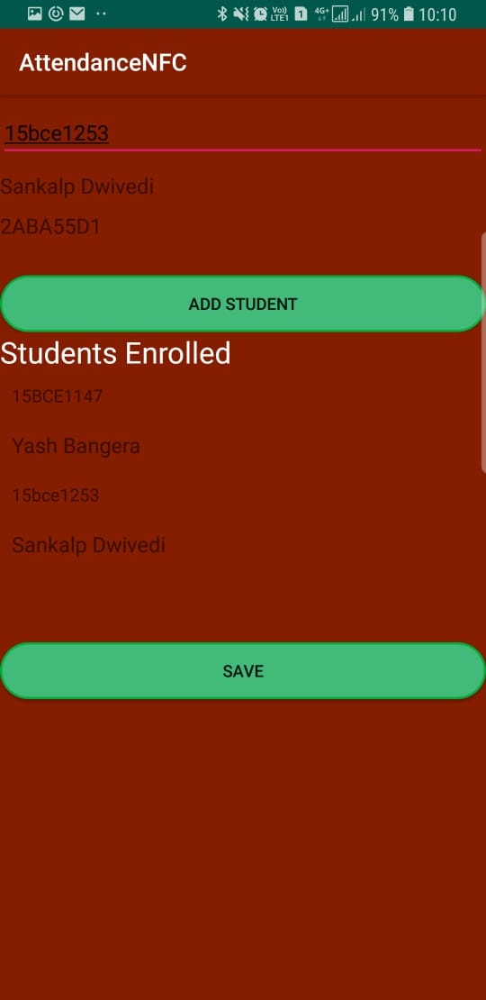

# NFC-Attendance

This Android applications scans RFID tags installed in student ID cards to store their credentials and use them to take attendance.
It only works on NFC enabled smartphones. 

The app contains the following modules:

1) Homepage

This page provides the user three choices
a) Take Attendance
b) Add a new class
c) Add students

a) Take Attendace

This will show the list of classes you have added.

You can edit class name and code by long pressing the class. This will open edit mode.

Select one class to continue. The next screen will show students added to this class highlighted in light red.

After you scan a student's ID card, that student's name will turn green.

2) Add Students

This is the first step you need to take in order to use the app. Scan the ID cards of students and put in their details.

Future work to be done is to provide the user the capability to import the details from an excel or csv file.

3) Add New Class

You can create new classes in which you will add the students whose credentials you currently have on device.

After you tap continue you can search the student roster using the ID number which will work as the primary key.

